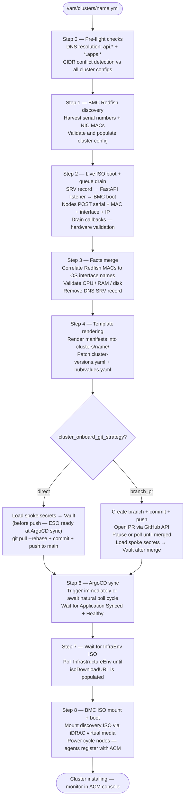
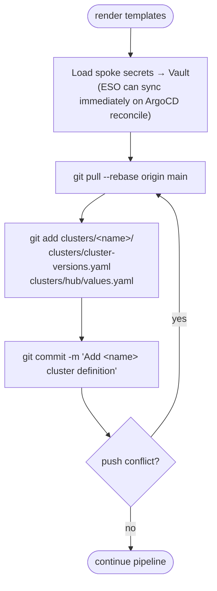
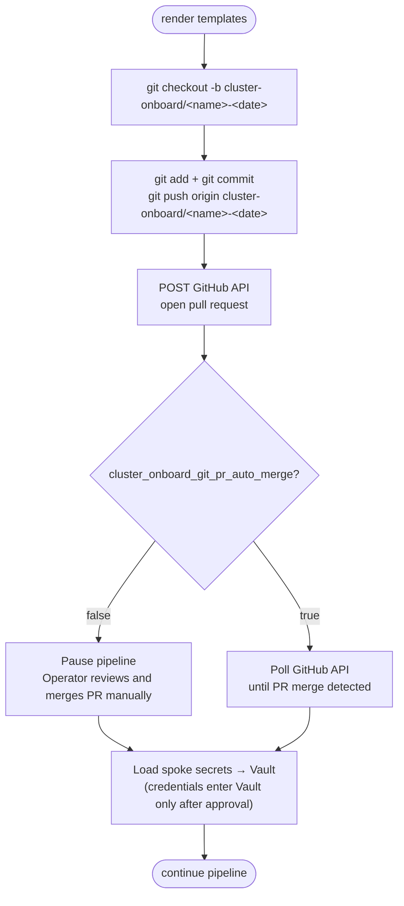
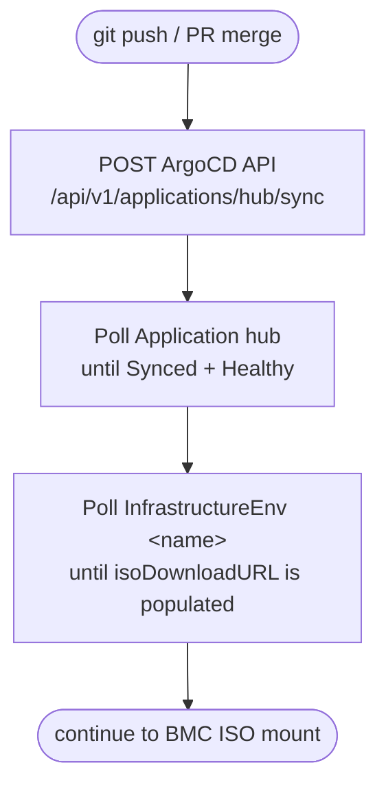
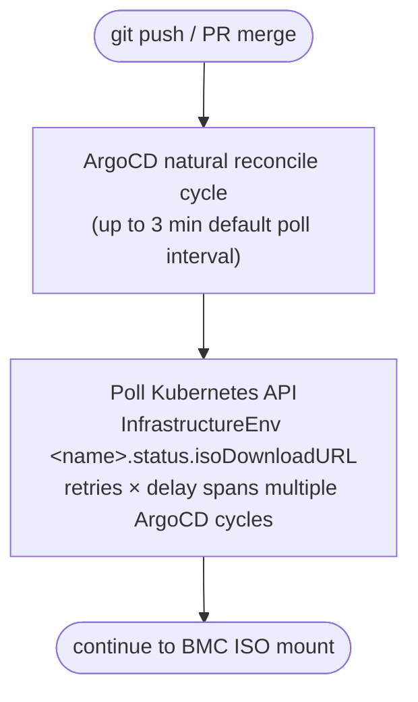

# Cluster Onboarding Pipeline

This document describes the automated pipeline for onboarding a new bare metal
OpenShift cluster into ACM management. The pipeline is driven by a single
cluster definition YAML file and handles hardware discovery, manifest generation,
Git operations, and BMC-controlled installation end to end.

The pipeline is designed to be configurable — several operational decisions have
meaningful trade-offs that vary by team, environment, and change management
requirements. Each such decision is documented with its options and pros/cons so
teams can select the mode that fits their operational context. The Ansible
implementation supports all modes via variables; no code changes are required to
switch between them.

---

## Table of Contents

1. [Pipeline Overview](#1-pipeline-overview)
2. [Operational Decision: Git Commit Strategy](#2-operational-decision-git-commit-strategy)
3. [Operational Decision: ArgoCD Sync Strategy](#3-operational-decision-argocd-sync-strategy)
4. [Pipeline Variable Reference](#4-pipeline-variable-reference)

---

## 1. Pipeline Overview



### Vault Sequencing Rationale

The position of the Vault secret load step differs intentionally between
strategies:

**`direct` — Vault before push:**
The pipeline loads spoke secrets into Vault _before_ pushing to Git. This
ensures that when ArgoCD reconciles the new `InfrastructureEnv`, the
`ExternalSecret` for the pull secret can resolve immediately — no sync
failure due to a missing Vault path.

**`branch_pr` — Vault after merge:**
The pipeline delays loading spoke secrets into Vault until _after_ the PR is
merged. This provides an additional layer of secrets hygiene: sensitive
credentials (pull secret, SSH key, BMC passwords) only enter Vault once the
cluster definition has been reviewed and approved. A closed PR means no
credentials to clean up.

---

## 2. Operational Decision: Git Commit Strategy

### Overview

After templates are rendered, the cluster definition files must land in the
remote Git repository before ArgoCD can act on them. Two strategies are
supported, controlled by `cluster_onboard_git_strategy`.

The `clusters/<name>/` directory, the `clusters/cluster-versions.yaml` update,
and the `clusters/hub/values.yaml` Application entry are always committed
together in a single atomic commit regardless of which strategy is chosen,
ensuring ArgoCD never sees a cluster directory without its corresponding
branch-pinning entry or Application registration.

---

### Option A: Direct to `main` — `git_strategy: direct`

The pipeline commits the rendered manifests directly to the `main` branch and
pushes. ArgoCD detects the change on its next poll cycle or on an explicit sync
trigger.



**Pros**

| | |
|---|---|
| Fastest path to cluster availability | No PR review wait — ArgoCD acts as soon as the push lands |
| Simplest implementation | No GitHub API integration required |
| Fully automated | No human intervention step in the pipeline |
| Appropriate for gated automation | If running the playbook already requires elevated Vault access and cluster admin rights, the playbook itself is the review gate |

**Cons**

| | |
|---|---|
| No pre-ArgoCD human review | A misconfigured cluster YAML goes directly into production GitOps |
| Not suitable for change management environments | ITIL / CAB approval workflows cannot interpose between generate and deploy |
| Harder to cancel mid-flight | Once pushed, ArgoCD will attempt to sync; cancellation requires a revert commit |

**Best suited for:**
- Fully trusted automation pipelines with upstream validation
- Lab, development, and CI environments
- Teams where the cluster config YAML itself goes through a review process before the pipeline is invoked

---

### Option B: Feature branch + pull request — `git_strategy: branch_pr`

The pipeline creates a feature branch, commits the rendered manifests there,
pushes, and opens a pull request via the GitHub API. The pipeline optionally
pauses for human review before proceeding, or can continue to later steps while
the PR is open (if those steps do not depend on ArgoCD sync).



**Pros**

| | |
|---|---|
| Human review gate | A team member reviews generated manifests before ArgoCD acts |
| Audit trail | PR comments, approvals, and review history are permanently associated with the cluster onboarding event |
| Change management compatible | PR can be the ticket artifact for CAB approval |
| Easy cancellation | Close the PR — no revert commit needed, no cluster is partially created, no credentials loaded |
| Branch protection rules enforced | GitHub required reviewers, status checks, and approval counts apply naturally |
| Secrets hygiene | Credentials enter Vault only after the definition is approved |

**Cons**

| | |
|---|---|
| Pipeline pauses for human action | Unless `pr_auto_merge: true`, the pipeline waits indefinitely for merge |
| Requires GitHub API credentials | A PAT with `repo` scope must be stored in Vault and available to the pipeline |
| Additional pipeline complexity | Branch creation, push, and API call add steps and failure modes |
| ArgoCD sync delayed until merge | Time to cluster availability is extended by however long PR review takes |

**Best suited for:**
- Production environments with change management requirements
- Multi-team environments where cluster definitions require peer review
- Organizations using GitHub branch protection rules on `main`

---

### Configuring the git commit strategy

```yaml
# ansible/vars/acm_config.yml  or  vars/clusters/<name>.yml

# "direct"    — commit and push directly to main
# "branch_pr" — create feature branch, push, open PR
cluster_onboard_git_strategy: "direct"

# Prefix for the feature branch name (branch_pr mode only)
# Branch created as: <prefix>/<cluster-name>-<YYYY-MM-DD>
cluster_onboard_git_branch_prefix: "cluster-onboard"

# true  — pipeline polls GitHub API until PR is merged, then continues
# false — pipeline pauses with a prompt; operator merges PR manually
cluster_onboard_git_pr_auto_merge: false

# GitHub repository details (branch_pr mode — PR creation via API)
github_org: "your-org"
github_repo: "openshift-acm-app-of-apps"
# GitHub PAT stored in Vault at secret/hub/gitops-repo → fields.token
```

---

## 3. Operational Decision: ArgoCD Sync Strategy

### Overview

After the cluster manifests land in Git (via either commit strategy above),
ArgoCD must reconcile the hub Application to generate the new cluster's
`InfrastructureEnv`. The pipeline needs that reconcile to complete before it
can retrieve the discovery ISO URL and proceed to BMC boot.

Two strategies are supported, controlled by `cluster_onboard_argocd_sync_strategy`.

---

### Option A: Trigger immediately — `argocd_sync_strategy: trigger`

The pipeline calls the ArgoCD API to force an immediate sync of the hub
Application after the Git push. It then polls the Application status until
sync completes and the `InfrastructureEnv` resource appears.



**Pros**

| | |
|---|---|
| Fastest pipeline progression | No waiting for the 3-minute (default) ArgoCD poll interval |
| Immediate sync failure feedback | Pipeline catches ArgoCD sync errors before proceeding to BMC boot |
| Predictable pipeline timing | Total elapsed time is not subject to where in the poll cycle the push landed |

**Cons**

| | |
|---|---|
| Requires ArgoCD API access | Controller needs a route to the ArgoCD server and a valid token |
| Additional credential management | ArgoCD token must be stored in Vault and retrieved by the pipeline |
| API surface dependency | ArgoCD API changes across versions could affect the pipeline |
| Meaningless with branch+PR strategy | Triggering sync before the PR is merged has no effect; the two strategies must be coordinated |

**Note:** When using `git_strategy: branch_pr`, the sync trigger fires
automatically after the pipeline detects PR merge — not immediately after the
PR is created.

---

### Option B: Natural poll interval — `argocd_sync_strategy: poll`

The pipeline does not interact with the ArgoCD API. It simply polls the
Kubernetes API for the `InfrastructureEnv` resource to appear and for the
`isoDownloadURL` to be populated, waiting for ArgoCD's natural reconcile cycle
to pick up the Git change.



**Pros**

| | |
|---|---|
| No ArgoCD API credentials needed | Pipeline only needs cluster API access (already required for other steps) |
| Simpler implementation | No ArgoCD token management or API call logic |
| Version-agnostic | Works regardless of ArgoCD version or API changes |
| Lower coupling | Pipeline does not depend on ArgoCD internal endpoints |

**Cons**

| | |
|---|---|
| Adds up to 3 minutes of latency | Default ArgoCD poll interval; actual wait depends on where in the cycle the push landed |
| Delayed sync error detection | If ArgoCD fails to sync (e.g., manifest error), the pipeline only discovers this after the poll timeout expires |
| Less precise pipeline timing | Total elapsed time varies by up to one poll interval per run |

**Tuning the poll interval:** The ArgoCD poll interval can be reduced from the
default 3 minutes by setting `timeout.reconciliation` in the
`argocd-cm` ConfigMap. A value of `30s` or `60s` significantly reduces pipeline
latency without requiring API trigger integration.

---

### Configuring the ArgoCD sync strategy

```yaml
# ansible/vars/acm_config.yml  or  vars/clusters/<name>.yml

# "trigger" — call ArgoCD API to force immediate sync after git push
# "poll"    — wait for ArgoCD natural reconcile cycle
cluster_onboard_argocd_sync_strategy: "trigger"

# Retries × delay for polling InfrastructureEnv isoDownloadURL
# Covers both the ArgoCD reconcile wait and the Assisted Installer
# ISO generation time (typically 2-5 minutes after sync)
cluster_onboard_infraenv_poll_retries: 40
cluster_onboard_infraenv_poll_delay: 30   # seconds — total max: 20 min

# ArgoCD server hostname (trigger mode)
# Retrieved from the Route automatically if not set
argocd_server: ""

# ArgoCD token stored in Vault at secret/hub/argocd → fields.token
# Required for trigger mode only
```

---

## 4. Pipeline Variable Reference

All pipeline operational variables with defaults. Set in
`ansible/vars/acm_config.yml` for fleet-wide defaults, or override per-cluster
in `vars/clusters/<name>.yml`.

| Variable | Default | Description |
|----------|---------|-------------|
| `cluster_onboard_git_strategy` | `direct` | Git commit strategy: `direct` or `branch_pr` |
| `cluster_onboard_git_branch_prefix` | `cluster-onboard` | Feature branch prefix (branch_pr only) |
| `cluster_onboard_git_pr_auto_merge` | `false` | Auto-merge PR when checks pass (branch_pr only) |
| `github_org` | — | GitHub organization name (branch_pr only) |
| `github_repo` | `openshift-acm-app-of-apps` | GitHub repository name (branch_pr only) |
| `cluster_onboard_argocd_sync_strategy` | `trigger` | ArgoCD sync strategy: `trigger` or `poll` |
| `cluster_onboard_infraenv_poll_retries` | `40` | Retries when polling for isoDownloadURL |
| `cluster_onboard_infraenv_poll_delay` | `30` | Seconds between retries |
| `argocd_server` | auto-detected | ArgoCD server hostname (trigger mode only) |
| `cluster_onboard_listener_port` | `8080` | FastAPI registration listener port (Step 2) |
| `cluster_onboard_listener_host` | `ansible_default_ipv4.address` | IP address nodes POST callbacks to |
| `cluster_onboard_listener_timeout` | `600` | Max seconds to wait for all node registrations |
| `cluster_onboard_node_poll_timeout` | `35` | Long-poll timeout on GET /drain endpoint |
| `cluster_onboard_preflight_dns_check` | `true` | Enable DNS pre-flight validation |
| `cluster_onboard_preflight_cidr_check` | `true` | Enable network CIDR conflict detection |

### Recommended combinations

| Environment | git_strategy | argocd_sync_strategy | Rationale |
|-------------|-------------|---------------------|-----------|
| Lab / development | `direct` | `poll` | Simplest setup; poll interval acceptable |
| CI / automated testing | `direct` | `trigger` | Speed matters; pipeline runs headless |
| Production (trusted pipeline) | `direct` | `trigger` | Gated at Vault access level; fast onboarding |
| Production (change management) | `branch_pr` | `trigger` | PR is the CAB artifact; trigger fires post-merge |
| Air-gapped / no ArgoCD API | `direct` | `poll` | No external API access; tune poll interval |
