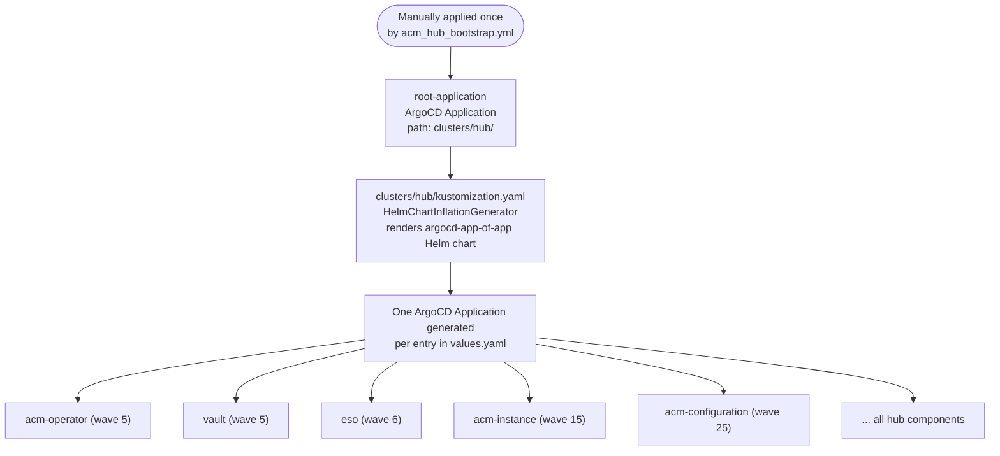
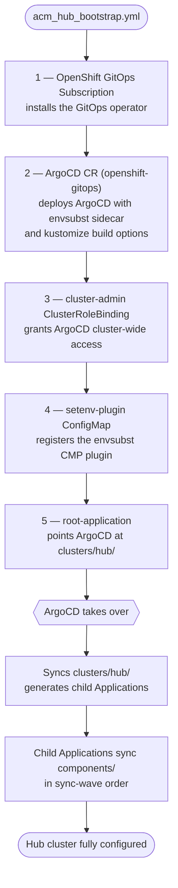
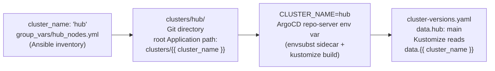
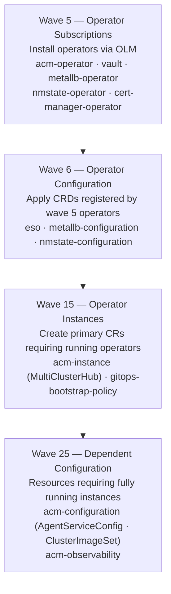

# GitOps Architecture

This document explains how the GitOps layer of this project is wired: what the
app-of-apps pattern is, how the root Application bootstraps everything, how a
single variable threads through Ansible, Git, and ArgoCD, what the envsubst
sidecar does and why it exists, how sync wave ordering works, and how branch
promotion is controlled. Read this before modifying any ArgoCD resources or
adding cluster directories.

---

## Table of Contents

1. [The App-of-Apps Pattern](#1-the-app-of-apps-pattern)
2. [Repository Structure and ArgoCD Mapping](#2-repository-structure-and-argocd-mapping)
3. [The Bootstrap Sequence](#3-the-bootstrap-sequence)
4. [The `cluster_name` Chain](#4-the-cluster_name-chain)
5. [The envsubst Sidecar](#5-the-envsubst-sidecar)
6. [Sync Wave Ordering](#6-sync-wave-ordering)
7. [Branch Promotion via `cluster-versions.yaml`](#7-branch-promotion-via-cluster-versionsyaml)

---

## 1. The App-of-Apps Pattern

ArgoCD manages Kubernetes resources by reconciling **Applications** — objects that
point at a Git path and sync whatever is there to a cluster. The app-of-apps
pattern uses one ArgoCD Application (the **root Application**) whose sole job is
to generate more ArgoCD Applications. Those child Applications each manage a
specific component: an operator subscription, a Helm release, a configuration
set. Nothing is manually applied to the cluster after the root Application is
created — everything cascades from it.

The benefit: adding a new component means adding an entry to `values.yaml` and
pushing to Git. ArgoCD detects the new child Application on its next sync and
reconciles the component automatically. No `kubectl apply` required after
bootstrap.



Each child Application points at a `components/<name>/` path and manages that
component's Kubernetes resources independently. ArgoCD reconciles all child
Applications concurrently, subject to sync wave ordering (see
[Section 6](#6-sync-wave-ordering)).

---

## 2. Repository Structure and ArgoCD Mapping

The directory layout maps directly onto ArgoCD concepts:

| Directory | ArgoCD role | Contents |
|-----------|-------------|----------|
| `.bootstrap/` | Applied once, manually | Root Application, ArgoCD CR, RBAC, envsubst ConfigMap |
| `clusters/<name>/` | Root Application target | `kustomization.yaml` + `values.yaml` — generates child Applications |
| `groups/all/` | Shared values base | Operators and AppProject common to all clusters |
| `components/<name>/` | Child Application target | Kustomize manifests for each operator or configuration component |
| `.helm-charts/argocd-app-of-app/` | Helm chart | Template loop that produces Application and AppProject CRs |
| `clusters/cluster-versions.yaml` | Branch control | ConfigMap Kustomize reads to set `targetRevision` on all generated Applications |

The root Application never directly manages operators or CRDs. It manages only the
ArgoCD Applications that manage those things. This keeps the root Application
simple and stable — it changes only when a new cluster directory is added or the
Helm chart itself is updated.

---

## 3. The Bootstrap Sequence

`acm_hub_bootstrap.yml` applies five objects to the hub cluster in order. After
that, human action is not required again — ArgoCD drives the hub to its fully
configured state.



The root Application is the only ArgoCD Application ever manually applied. Every
other Application in the cluster is generated and managed by ArgoCD itself.

---

## 4. The `cluster_name` Chain

A single variable — `cluster_name` — connects four layers of the system. This
chain explains why `clusters/hub/` is named `hub`, why the key in
`cluster-versions.yaml` is `hub`, and why the ArgoCD environment variable is
`CLUSTER_NAME=hub`. None of these names are reserved in ArgoCD — they are
project convention, kept consistent so that one value is the source of truth
across all four layers.



The chain works identically for spoke clusters. The `cluster.name` value set in
`vars/clusters/<name>.yml` drives the `clusters/<name>/` Git directory (created by
the onboarding pipeline), which becomes the `CLUSTER_NAME` env var on any spoke
ArgoCD instance, which becomes the branch-pinning key in `cluster-versions.yaml`.

Changing `cluster_name` from `hub` to any other value — say `management` — would
require renaming the `clusters/hub/` directory to `clusters/management/` and
updating the `cluster-versions.yaml` key from `hub` to `management`. ArgoCD
itself has no awareness of the change; it simply follows wherever the root
Application's `path` points.

---

## 5. The envsubst Sidecar

ArgoCD's Kustomize and Helm rendering is intentionally hermetic — it runs without
access to cluster state or runtime values. This creates a problem when manifests
need to embed cluster-specific values (cluster name, base domain, GitOps repo URL)
that differ between the hub and spoke clusters, even though they share the same
Git repository.

The solution is an ArgoCD **Config Management Plugin (CMP)** sidecar that runs
`envsubst`. It substitutes environment variables into manifests before ArgoCD
applies them to the cluster.

### Environment variables available

The ArgoCD CR configures the repo-server — and the sidecar — with four variables,
set by Ansible from inventory values at bootstrap time:

| Variable | Example value | Source |
|----------|---------------|--------|
| `CLUSTER_NAME` | `hub` | `cluster_name` in `group_vars/hub_nodes.yml` |
| `CLUSTER_BASE_DOMAIN` | `hub.example.com` | `cluster_name + "." + base_domain` |
| `PLATFORM_BASE_DOMAIN` | `example.com` | `base_domain` |
| `INFRA_GITOPS_REPO` | `https://github.com/<org>/openshift-acm-app-of-apps` | `gitops_repo` |

### Opting in — the sentinel file

The sidecar does not run on every directory. A component opts in by placing an
empty `.use-setenv-plugin` file at the root of its source path. ArgoCD discovers
the sentinel and routes that directory through the `setenv-plugin` CMP instead
of the default Kustomize renderer. Standard Kustomize-only components that do not
reference any `${VAR}` patterns do not need the sentinel and are unaffected.

### When to use the sidecar vs. values.yaml

The Helm chart already handles structured configuration through values merging —
`groups/all/values.yaml` provides the shared baseline and `clusters/<name>/values.yaml`
overrides per cluster. The envsubst sidecar complements this for cases where
variable substitution is needed inside arbitrary YAML fields (resource names,
labels, annotation values, URL strings) where Helm templating or Kustomize patches
would be verbose. Both mechanisms coexist in the same cluster.

---

## 6. Sync Wave Ordering

ArgoCD sync waves control the order in which resources are applied within a single
sync operation. A resource in wave N is not applied until all resources in wave
N−1 are Healthy. This project uses four waves:



### Why these specific waves

The gaps between wave numbers are intentional — they leave room to insert
components between existing waves without renumbering. The wave assignments
reflect real dependency chains in this stack:

**ESO at wave 6, Vault at wave 5.** ESO's `ClusterSecretStore` references the
Vault service. If ESO deploys before Vault's pod is ready, the store remains
`NotReady` until Vault is reachable. Vault subscription at wave 5 ensures the
service is up before ESO attempts its first connection.

**MetalLB configuration at wave 6, MetalLB operator at wave 5.** The
`IPAddressPool` and `L2Advertisement` CRDs do not exist until the operator is
installed. Applying configuration before the operator would fail with
`no matches for kind`.

**MultiClusterHub at wave 15, ACM operator at wave 5.** The `MultiClusterHub` CR
requires ACM's CRDs. It also takes 10–20 minutes to reach `Running` state. Wave
15 allows operators and their configurations to stabilize before the hub CR is
created, reducing the chance of a race-condition sync failure.

**AgentServiceConfig at wave 25, MultiClusterHub at wave 15.** The Assisted
Installer service is part of MultiClusterEngine, which ACM installs and manages.
`AgentServiceConfig` cannot be created until MCE is available and its CRDs are
registered.

---

## 7. Branch Promotion via `cluster-versions.yaml`

`clusters/cluster-versions.yaml` is a ConfigMap that controls which git branch
each cluster's ArgoCD Applications track:

```yaml
data:
  hub: main          # hub cluster tracks main
  spoke1: main       # spoke1 tracks main
  spoke2: release-1.0  # spoke2 promoted to a release branch
```

The value is stamped onto every generated Application via a Kustomize
**replacement** in `clusters/<name>/kustomization.yaml`:

```yaml
replacements:
  - source:
      kind: ConfigMap
      name: cluster-versions
      fieldPath: data.hub          # reads data.<cluster_name>
    targets:
      - select:
          kind: Application
        fieldPaths:
          - spec.source.targetRevision  # writes to every Application
```

At `kustomize build` time, Kustomize reads the ConfigMap entry for this cluster
and stamps it onto `spec.source.targetRevision` in every generated Application,
overriding whatever the Helm chart defaulted to. The comment in
`clusters/hub/values.yaml` makes this explicit:

> _All targetRevision values are overwritten at kustomize build time by the
> Kustomize replacement that reads clusters/cluster-versions.yaml. Set
> targetRevision here only for documentation; the replacement wins._

### Promoting a cluster to a release branch

No playbook is required. Edit `clusters/cluster-versions.yaml`, change the branch
for the target cluster, and push:

```yaml
data:
  hub: main
  spoke1: release-1.0  # changed from main
```

On the next ArgoCD sync cycle, the replacement runs, all of spoke1's Applications
switch to tracking `release-1.0`, and ArgoCD reconciles the diff. The branch
change is atomic across all Applications for that cluster — there is no window
where some Applications track the old branch and others the new one.

### Why cluster-versions.yaml instead of values.yaml

`cluster-versions.yaml` is both a file in Git and a ConfigMap deployed on the
cluster. The Kustomize replacement reads the ConfigMap, which means the
currently-active branch for each cluster is inspectable without a Git checkout:

```bash
oc get configmap cluster-versions -n openshift-gitops -o yaml
```

This makes it a genuinely single source of truth — visible in the ArgoCD UI,
queryable with `oc`, and version-controlled in Git.
