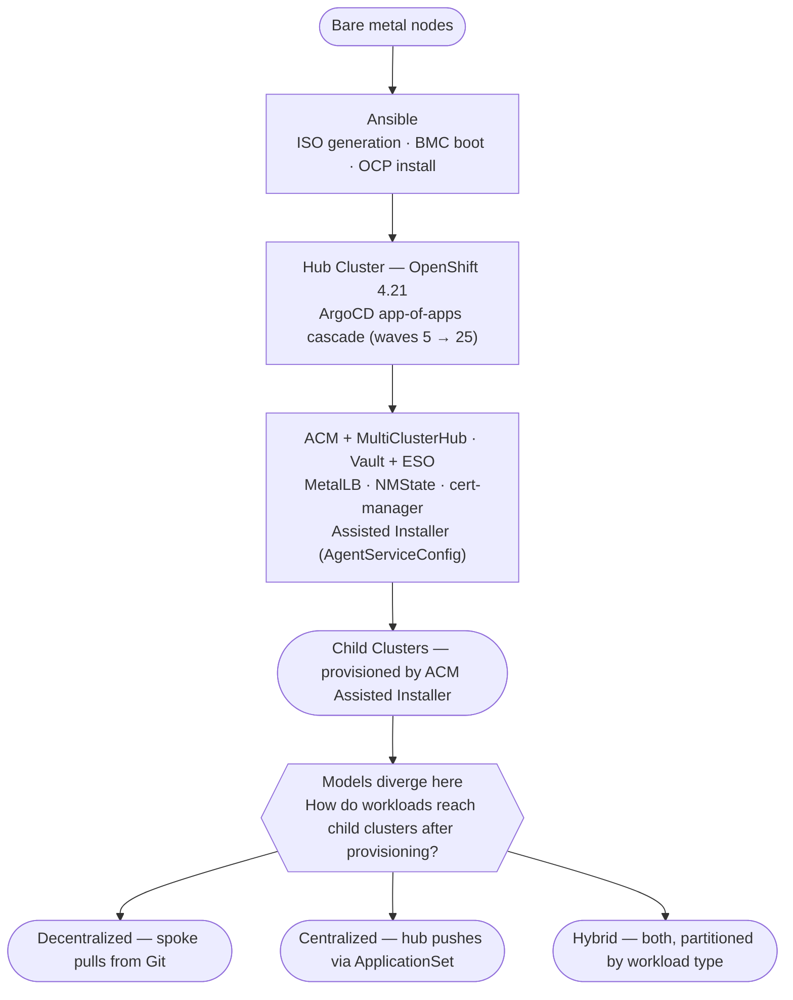
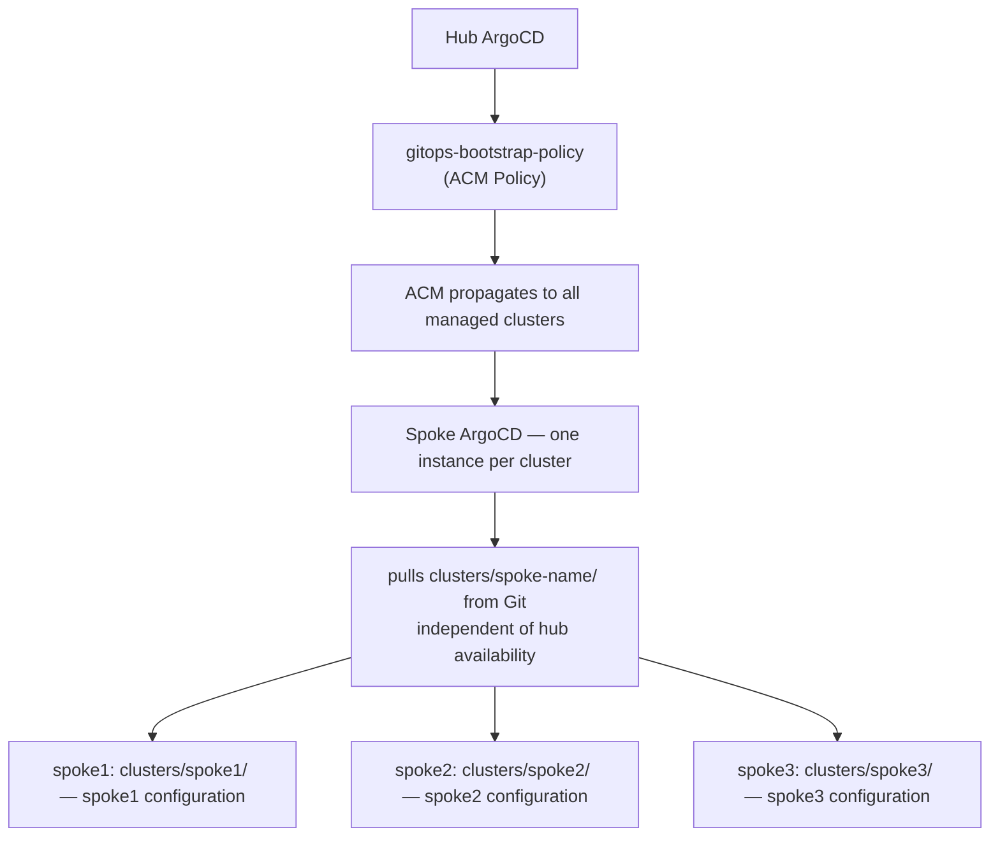
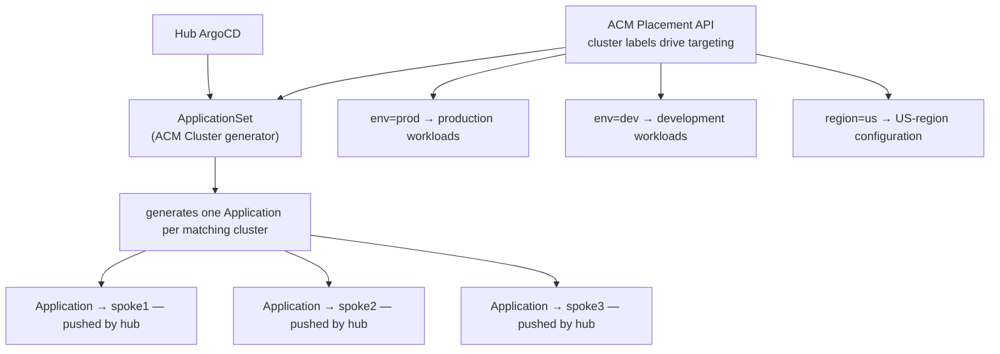
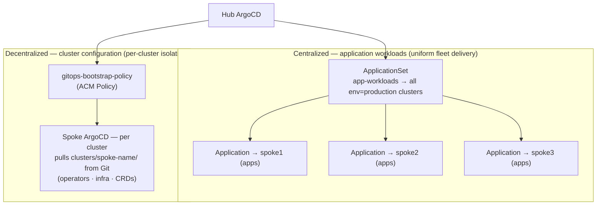

# GitOps Delivery Models

This project is intentionally structured to support three approaches to delivering workloads across multiple OpenShift clusters: **Decentralized (Pull)**, **Centralized (Push)**, and **Hybrid**. This document explains how each model works, where the architectural differences lie, and the operational trade-offs that should inform your choice.

---

## Table of Contents

1. [Where the Models Diverge](#1-where-the-models-diverge)
2. [Decentralized (Pull) Model](#2-decentralized-pull-model)
3. [Centralized (Push) Model](#3-centralized-push-model)
4. [Hybrid Model](#4-hybrid-model)
5. [Decision Guide](#5-decision-guide)
6. [How This Project Supports Each Model](#6-how-this-project-supports-each-model)

---

## 1. Where the Models Diverge

Everything up to the point of workload delivery is identical across all three models:



The hub cluster installation, ACM configuration, secrets management, and spoke cluster provisioning are the same regardless of which model you choose. The fork in the road is narrow and comes late: it concerns only how GitOps-managed configuration and workloads are delivered *to* spoke clusters after they exist.

---

## 2. Decentralized (Pull) Model

### How It Works

Each managed cluster runs its own ArgoCD instance. ACM acts as the bootstrap mechanism — it delivers the GitOps engine and an initial root Application to the spoke. Once bootstrapped, the spoke's ArgoCD pulls its configuration directly from Git, independent of the hub.



### Per-Cluster Git Structure

Each spoke cluster has its own directory in this repository:

```
clusters/
├── cluster-versions.yaml     # maps each cluster to its git branch
├── hub/
│   ├── kustomization.yaml
│   └── values.yaml
├── spoke1/
│   ├── kustomization.yaml    # spoke1 pulls this
│   └── values.yaml
└── spoke2/
    ├── kustomization.yaml    # spoke2 pulls this
    └── values.yaml
```

The spoke's ArgoCD root Application points at `clusters/<spoke-name>` in this repository. The `cluster-versions.yaml` ConfigMap determines which git branch each cluster tracks, allowing independent branch promotion across the fleet.

### Pros

| Advantage | Detail |
|-----------|--------|
| **Blast radius isolation** | A misconfigured hub ArgoCD cannot affect spoke workloads. Each cluster's GitOps engine is self-contained. |
| **Hub independence** | Spokes continue to operate normally if the hub becomes unavailable. No central point of failure for workload delivery. |
| **Independent promotion** | Each cluster can track a different git branch (dev, staging, production) via `cluster-versions.yaml`. Spokes are promoted individually. |
| **Auditability** | Every cluster's desired state is explicit in its own `clusters/<name>/` directory. Easy to reason about what is deployed where. |
| **Scales naturally** | Adding a cluster means adding a directory. No central ApplicationSet to manage or update. |
| **Compliance boundary support** | Clusters in regulated environments can be configured without touching hub-wide configuration. |

### Cons

| Disadvantage | Detail |
|--------------|--------|
| **Resource overhead** | Every spoke runs its own ArgoCD instance (repo-server, application-controller, server, dex). For many small clusters, this adds up. |
| **Bootstrapping complexity** | Getting the initial root Application onto each spoke requires ACM Policy + PlacementRule or a separate Ansible playbook targeting each spoke post-install. |
| **Secret distribution** | Spoke clusters need credentials to pull from private Git repositories. These must be distributed to each spoke's ArgoCD, typically via ACM Policy or ESO. |
| **Fleet-wide rollouts require coordination** | Applying a change to all clusters means updating every `clusters/<name>/values.yaml`, or coordinating branch merges across the fleet. A shared `groups/all/` helps but requires each cluster's ArgoCD to pick it up independently. |
| **Observability is distributed** | Monitoring ArgoCD sync status across many clusters requires aggregation (ACM console, Grafana, or hub-side tooling) — no single ArgoCD UI shows the full picture. |

### Operational Considerations

- **Branch strategy matters most here.** Define a clear policy for when clusters are promoted (e.g., `dev` → `staging` → `main`) and how that promotion is triggered. The `cluster-versions.yaml` file is the single control point for branch tracking per cluster — keep it in a protected branch with required PR review.
- **Monitor spoke ArgoCD health centrally.** ACM's `ManagedClusterView` can surface ArgoCD Application status from spokes to the hub. Alternatively, configure the observability stack (`acm-observability`) to scrape ArgoCD metrics from all spokes.
- **Secret rotation is per-cluster.** If you rotate the Git repository credentials or the pull secret, each spoke's ArgoCD must be updated. ESO with hub-to-spoke ACM Policy propagation is the cleanest way to handle this at scale.
- **ArgoCD upgrades are per-cluster.** When the GitOps operator channel is updated, each spoke upgrades independently. Use `installPlanApproval: Manual` on spokes to gate upgrades across the fleet if you need coordinated rollout.

---

## 3. Centralized (Push) Model

### How It Works

A single ArgoCD instance runs on the ACM Hub. Spoke clusters are registered as ArgoCD destination endpoints — they do not run their own ArgoCD. The hub ArgoCD uses **ApplicationSets** combined with the **ACM Placement API** to discover managed clusters and push workloads to them. ACM cluster labels and Placement rules drive which workloads go to which clusters.



### ApplicationSet with ACM Cluster Generator

The core pattern uses the ArgoCD `cluster` generator with ACM's cluster inventory:

```yaml
apiVersion: argoproj.io/v1alpha1
kind: ApplicationSet
metadata:
  name: spoke-operators
  namespace: openshift-gitops
spec:
  generators:
    - clusters:
        selector:
          matchLabels:
            env: production          # ACM ManagedCluster label
  template:
    metadata:
      name: "{{name}}-operators"
    spec:
      project: cluster-config
      source:
        repoURL: https://github.com/<your-org>/openshift-acm-app-of-apps
        targetRevision: main
        path: workloads/operators    # shared path for all matching clusters
      destination:
        server: "{{server}}"         # injected per cluster by the generator
        namespace: openshift-operators
      syncPolicy:
        automated:
          prune: true
          selfHeal: true
```

### Pros

| Advantage | Detail |
|-----------|--------|
| **Single pane of glass** | One ArgoCD UI shows sync status for all workloads across all clusters. Easier for small teams managing many clusters. |
| **No spoke-side GitOps overhead** | Spoke clusters do not run ArgoCD. Reduced resource consumption per spoke, especially relevant for edge or resource-constrained clusters. |
| **Instant fleet-wide rollout** | Updating the ApplicationSet template or the underlying manifests propagates to all matching clusters on the next sync cycle — no per-cluster coordination needed. |
| **Label-driven targeting** | ACM cluster labels (`env=prod`, `region=us`, `tier=edge`) drive which clusters receive which workloads without changing Git. Adding a label to a cluster immediately makes it a target for matching ApplicationSets. |
| **Simpler credential management** | Hub ArgoCD needs spoke credentials, but those are managed in one place — no per-spoke ArgoCD credential distribution. |
| **Easier compliance reporting** | Single ArgoCD can report drift across the entire fleet. |

### Cons

| Disadvantage | Detail |
|--------------|--------|
| **Hub is a critical dependency** | If the hub ArgoCD is degraded, workload delivery to all spokes stops. The hub becomes a single point of failure for the entire fleet's GitOps operations. |
| **Spoke credential management** | The hub ArgoCD must hold a kubeconfig or service account token for every spoke. These credentials must be rotated and secured centrally (typically via ESO). ACM's `ManagedServiceAccount` can automate this. |
| **Blast radius** | A bad hub-side ApplicationSet change can simultaneously affect all matching clusters. Lack of per-cluster isolation is the flip side of easy fleet rollout. |
| **Network dependency** | Hub must have network reachability to every spoke's API server. In disconnected or air-gapped environments, this can be a hard constraint. |
| **ApplicationSet complexity grows** | As the fleet diversifies (different OCP versions, different hardware profiles, different compliance requirements), ApplicationSets accumulate conditional logic and multiple generators. Maintenance burden grows with fleet heterogeneity. |
| **Less natural branch promotion** | Without per-cluster ArgoCD, tracking different git branches per cluster requires separate ApplicationSets or parameterized sources — less elegant than the decentralized `cluster-versions.yaml` approach. |

### Operational Considerations

- **Cluster credentials are the operational lynchpin.** The hub ArgoCD needs a valid, rotated credential for every spoke. ACM's `ManagedServiceAccount` API (available in MCE 2.4+) can automatically provision and rotate short-lived tokens — use it in preference to static kubeconfigs. Store the resulting secrets in Vault and surface them via ESO.
- **Label governance is critical.** ApplicationSets target clusters by label. A mistakenly applied label (`env=production` on a dev cluster) can cause a production ApplicationSet to target it. Implement RBAC on ManagedCluster label modifications and review them as carefully as you would review code.
- **Use `syncPolicy.automated` carefully.** With one ApplicationSet targeting 50 clusters, an automated prune on a bad commit can simultaneously delete resources fleet-wide. Consider `automated: {}` with only `selfHeal: true` and no prune until the rollout is validated, or use wave-based rollout with `syncOptions: [ApplyOutOfSyncOnly=true]`.
- **Hub ArgoCD sizing.** The application-controller reconciliation load scales linearly with the number of managed Applications. For large fleets (50+ clusters × workloads per cluster), tune the hub ArgoCD `application-controller` resource limits and `ARGOCD_APPLICATION_CONTROLLER_REPO_SERVER_TIMEOUT_SECONDS`.
- **Disconnected clusters.** If any spokes operate in a disconnected or intermittently connected environment, the centralized model breaks down for those clusters. Plan a mixed approach: centralized for always-connected clusters, decentralized for edge/disconnected nodes.

---

## 4. Hybrid Model

### How It Works

The hybrid model uses both ArgoCD instances and ApplicationSets simultaneously, partitioned by workload type:

- **Decentralized** for cluster-level configuration: operators, CRDs, cluster infrastructure, security policies — configuration that is cluster-specific and where per-cluster control matters
- **Centralized** for application workloads: shared applications deployed uniformly across multiple clusters, where fleet-wide rollout speed matters more than per-cluster isolation



### When Hybrid Makes Sense

| Scenario | Rationale |
|----------|-----------|
| Operators and CRDs per cluster, applications fleet-wide | Operator lifecycle is cluster-specific (version, channel, install plan approval). Application deployment benefits from centralized fleet rollout. |
| Mixed connectivity | Always-on clusters use centralized push; edge/disconnected clusters use decentralized pull. |
| Different team ownership | Platform team owns cluster config (decentralized, per-cluster isolation). App teams use centralized ApplicationSets to deploy their workloads uniformly. |
| Phased migration | Start decentralized; add centralized ApplicationSets incrementally as operational patterns are established. |

### Pros

Inherits the advantages of both models: blast-radius isolation for cluster infrastructure, operational simplicity for application delivery, natural branch promotion per cluster, and label-driven fleet rollout for shared workloads.

### Cons

Higher cognitive overhead — teams must understand which workloads are managed by which mechanism. Clear ownership boundaries and naming conventions (ApplicationSet names, namespace conventions, ArgoCD project separation) are essential to prevent confusion about what is deploying what to where.

### Operational Considerations

- **Define the boundary explicitly and document it.** The most common failure mode of the hybrid approach is ambiguity about which mechanism is authoritative for a given resource. Use separate ArgoCD `AppProject` resources for centralized vs. decentralized workloads. Enforce the boundary with project-level RBAC.
- **Avoid managing the same resource from both models.** If a spoke's ArgoCD and the hub's ApplicationSet both try to reconcile the same namespace or Deployment, you will get sync conflicts. Use `syncOptions: [ServerSideApply=true]` or field managers to surface ownership conflicts early.
- **The hub ArgoCD still needs spoke credentials** for the centralized portion, even if spoke clusters also run their own ArgoCD. Plan credential management accordingly.

---

## 5. Decision Guide

Answer these questions to identify your starting point:

**1. Is hub availability a hard dependency you can accept?**
- No → Decentralized (spokes must operate independently)
- Yes → Centralized or Hybrid

**2. Do you need per-cluster branch promotion (dev/staging/prod)?**
- Yes, frequently → Decentralized (cluster-versions.yaml is the natural mechanism)
- Rarely or never → Centralized (single branch, label-driven targeting)

**3. How many clusters, and how resource-constrained are they?**
- Many small/edge clusters → Centralized (no per-spoke ArgoCD overhead)
- Fewer, well-resourced clusters → Decentralized or Hybrid

**4. Do some clusters operate in disconnected or intermittently connected environments?**
- Yes → Decentralized for those clusters (pull works without hub reachability)

**5. Who owns cluster configuration vs. application delivery?**
- Same team → Either model works
- Different teams (platform vs. app) → Hybrid (platform team owns decentralized infra config; app team uses centralized ApplicationSets)

**6. How important is a single ArgoCD UI across the fleet?**
- Critical → Centralized
- Not critical, or you have ACM console / Grafana → Decentralized or Hybrid

### Summary Matrix

| Criteria | Decentralized | Centralized | Hybrid |
|----------|:---:|:---:|:---:|
| Hub is single point of failure | No | Yes | Partial |
| Spoke operates if hub down | Yes | No | Partial |
| Per-cluster branch promotion | Natural | Complex | Natural (infra) |
| Fleet-wide rollout speed | Slower | Fast | Fast (apps) |
| Resource overhead per spoke | Higher | Lower | Medium |
| Disconnected cluster support | Yes | No | Mixed |
| Single ArgoCD UI | No | Yes | No |
| Blast radius isolation | High | Low | Medium |
| Credential management complexity | Low | High | Medium |

---

## 6. How This Project Supports Each Model

### Current state

The project as shipped leans toward the **Decentralized** model through two design decisions:

1. **`components/gitops-bootstrap-policy/`** — The ACM Policy installs the OpenShift GitOps operator on every managed spoke cluster. This is the foundational act of the decentralized model.
2. **Per-cluster directory structure** — `clusters/<name>/kustomization.yaml` and `values.yaml`, combined with `cluster-versions.yaml` branch pinning, is oriented toward each cluster pulling its own configuration independently.

Neither decision is a hard lock. The codebase is structured to add centralized or hybrid capability without removing what is already there.

### Implementing Decentralized (Pull)

The infrastructure is already in place. For each spoke cluster, the remaining work is:

1. Create `clusters/<spoke-name>/` with `kustomization.yaml`, `values.yaml`, and the cluster provisioning resources (see [Child Cluster Onboarding](child-cluster-onboarding.md))
2. Add the spoke to `clusters/cluster-versions.yaml`
3. Create a spoke root Application (via ACM Policy or Ansible) that points the spoke's ArgoCD at `clusters/<spoke-name>`

### Implementing Centralized (Push)

To add centralized capability on top of the existing hub:

1. **Register spoke clusters with hub ArgoCD.** Use ACM's `ManagedServiceAccount` to provision per-spoke tokens, store them in Vault, and surface them as ArgoCD cluster secrets via ESO.
2. **Create ApplicationSets** in `clusters/hub/values.yaml` or a dedicated `components/applicationsets/` component, using the ACM cluster generator targeting cluster labels.
3. **Optionally disable `gitops-bootstrap-policy`** if you do not want spoke-side ArgoCD instances (pure centralized). Or leave it in place and run both (hybrid).

### Implementing Hybrid

No changes to the existing structure are needed. Add ApplicationSets to the hub ArgoCD for centralized workload delivery while retaining the per-cluster directories for decentralized cluster configuration. Define clear naming conventions and ArgoCD AppProjects to separate the two delivery lanes.

### What to Update in `groups/all/values.yaml`

For centralized or hybrid, you will add a new wave to the hub's application list for ApplicationSets. A wave-25 component is a natural fit — ApplicationSets should deploy after the hub is fully operational:

```yaml
# clusters/hub/values.yaml addition for centralized/hybrid
applications:
  fleet-applicationsets:
    path: components/fleet-applicationsets   # new component to create
    syncWave: "25"
    destination:
      namespace: openshift-gitops
```

The `components/fleet-applicationsets/` directory would contain the ApplicationSet resources targeting spoke clusters by ACM label, following the same Kustomize component pattern as the rest of the project.
