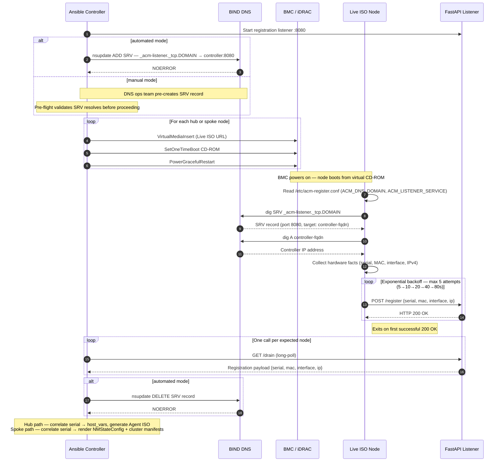
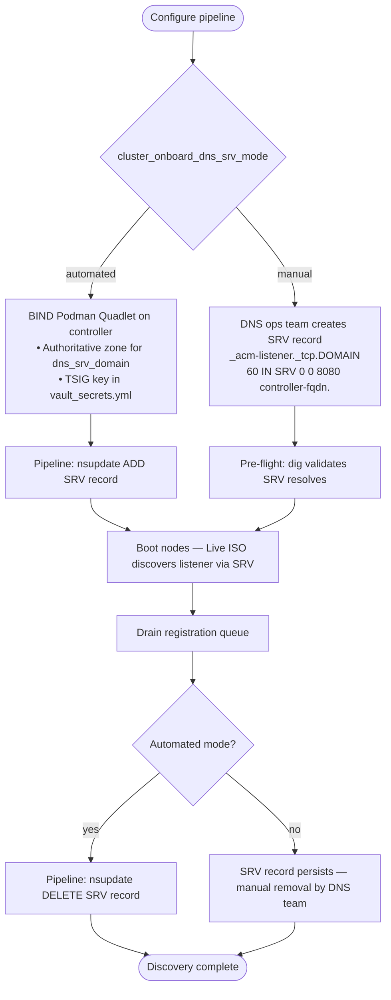

# Live ISO Integration

This document covers how to build and configure the hardware discovery Live ISO
used by the cluster onboarding pipeline. The Live ISO is a minimal CentOS Stream
bootable image that each bare metal node boots before its OpenShift installer ISO
is generated. It collects hardware facts (serial number, MAC address, OS interface
name) and phones them home to the Ansible controller via a DNS SRV-discovered
registration listener.

The Live ISO is used in two places in this project:

- **Hub cluster** (`bare_metal_prep.yml`) — nodes boot the Live ISO before the
  Agent-Based Installer ISO is generated, so that MAC addresses and interface
  names are discovered automatically rather than entered manually in `host_vars`.
- **Spoke clusters** (`cluster_onboard.yml`) — nodes boot the Live ISO as Step 2
  of the onboarding pipeline, before the Assisted Installer discovery ISO is mounted.

---

## Table of Contents

1. [How It Works](#1-how-it-works)
2. [Prerequisites](#2-prerequisites)
3. [Build the Live ISO](#3-build-the-live-iso)
4. [Stage the ISO on the HTTP Server](#4-stage-the-iso-on-the-http-server)
5. [Configure the Pipeline Variables](#5-configure-the-pipeline-variables)
6. [DNS SRV Record Setup](#6-dns-srv-record-setup)
7. [Variable Cross-Reference](#7-variable-cross-reference)
8. [Verify the Integration](#8-verify-the-integration)

---

## 1. How It Works



The Live ISO is built once and reused across all hub and spoke onboarding
operations. It does not embed any cluster-specific configuration — the DNS domain
(`ACM_DNS_DOMAIN`) is the only environment-specific value baked into the ISO.

---

## 2. Prerequisites

- **Podman** installed on the build host (can be the Ansible controller or any
  Linux machine with Podman)
- **centos-stream-ansible-iso** repository cloned:
  ```bash
  git clone https://github.com/heatmiser/centos-stream-ansible-iso
  cd centos-stream-ansible-iso
  ```
- **HTTP server** accessible from the controller — the same server used to stage
  the OpenShift Agent-Based Installer ISO can serve the Live ISO
- **~5 GB free disk space** on the build host for the KIWI build workspace
- UEFI firmware (`/usr/share/OVMF/OVMF_CODE.fd`) if performing a local boot test

---

## 3. Build the Live ISO

### 3.1 Create the configuration file

```bash
cp live-image.conf.example live-image.conf
```

Edit `live-image.conf` and set the required values. The minimum configuration for
ACM integration:

```bash
# Automation user — Ansible connects to the Live ISO via this account
LIVE_USERNAME="ansible"
LIVE_USER_SSHKEY_FILE="./keys/automation.pub"
LIVE_USER_GROUPS="wheel"
LIVE_USER_PASSWORD_HASH=""
LIVE_USER_SSHKEY=""

# === ACM cluster onboarding registration ===
# DNS domain for SRV record lookup at boot time.
# Nodes query: _acm-listener._tcp.<ACM_DNS_DOMAIN>
# Must match cluster_onboard_dns_srv_domain in ansible/vars/acm_config.yml.
ACM_DNS_DOMAIN="mgmt.example.com"

# SRV service name — must match cluster_onboard_mdns_service_name in acm_config.yml.
# Default value is correct unless you have customized the pipeline variable.
ACM_LISTENER_SERVICE="_acm-listener._tcp"

# Enable registration at boot
ACM_REGISTRATION_ENABLED="true"
```

> **`ACM_DNS_DOMAIN` is the only value that ties the ISO to your environment.**
> It must match `cluster_onboard_dns_srv_domain` in `ansible/vars/acm_config.yml`
> exactly. All other ACM variables use defaults that align with pipeline defaults.

### 3.2 Generate an SSH key for the automation user

Skip this step if you already have a key at `./keys/automation.pub`.

```bash
mkdir -p keys
ssh-keygen -t ed25519 -f keys/automation -N ""
```

### 3.3 (Optional) Create an encrypted vault for the password hash

If you want password authentication in addition to SSH key access:

```bash
cp live-image-vault.yml.example live-image-vault.yml
# Edit live-image-vault.yml and set live_user_password_hash
# Generate a hash with: openssl passwd -6 'YourPassword'

# Encrypt the vault
podman run --rm -it -v "$(pwd):/work:z" \
  quay.io/ansible/creator-ee:latest \
  ansible-vault encrypt /work/live-image-vault.yml
```

### 3.4 Run the build

```bash
./build-live-image.sh
```

The build runs entirely in Podman containers — no host packages beyond Podman are
required. A typical build takes 10–20 minutes on first run (package downloads
cached on subsequent builds).

**Output files in `outdir/`:**

| File | Description |
|------|-------------|
| `CentOS-Stream-MIN-Live-Automation.x86_64-10.iso` | Bootable UEFI Live ISO |
| `CentOS-Stream-MIN-Live-Automation.x86_64-10.packages` | Package manifest |
| `CentOS-Stream-MIN-Live-Automation.x86_64-10.verified` | ISO checksums |

### 3.5 Verify the ISO contains the registration files

```bash
# Mount the ISO and check for the registration script and service
iso_file="outdir/CentOS-Stream-MIN-Live-Automation.x86_64-10.iso"
tmpdir=$(mktemp -d)
mount -o loop,ro "${iso_file}" "${tmpdir}"

# Verify files are present
ls "${tmpdir}/LiveOS/"
isoinfo -i "${iso_file}" -f | grep acm

umount "${tmpdir}"
rmdir "${tmpdir}"
```

---

## 4. Stage the ISO on the HTTP Server

Copy the ISO to the HTTP server that also serves the OpenShift Agent-Based
Installer ISO. The staging location should be accessible from the controller at
a URL you will set as `cluster_onboard_live_iso_url`.

```bash
# Example: staging to the same HTTP server used for the Agent ISO
scp outdir/CentOS-Stream-MIN-Live-Automation.x86_64-10.iso \
    <http-server-user>@<http-server-ip>:/var/www/html/ocp/live-discovery.iso

# Verify it is served correctly
curl -I http://<http-server-ip>/ocp/live-discovery.iso
```

Set SELinux context if httpd is enforcing:

```bash
# On the HTTP server
restorecon -Rv /var/www/html/ocp/
```

---

## 5. Configure the Pipeline Variables

Set the following in `ansible/vars/acm_config.yml`:

```yaml
# URL where the Live ISO is served — nodes download from this URL via iDRAC
cluster_onboard_live_iso_url: "http://<http-server-ip>/ocp/live-discovery.iso"

# DNS SRV mode — "automated" creates the record via nsupdate; "manual" requires
# a DNS ops team to pre-create the record
cluster_onboard_dns_srv_mode: "automated"

# Must match ACM_DNS_DOMAIN in the ISO's live-image.conf exactly
cluster_onboard_dns_srv_domain: "mgmt.example.com"

# These match the ISO defaults — only change if you customized live-image.conf
cluster_onboard_mdns_service_name: "_acm-listener._tcp"
```

For automated DNS SRV mode, add the BIND TSIG key secret to
`ansible/vars/vault_secrets.yml`:

```bash
ansible-vault edit ansible/vars/vault_secrets.yml
```

Add:
```yaml
vault_dns_tsig_key_secret: "<base64 secret from tsig-keygen output>"
```

Generate a TSIG key if one does not exist yet:
```bash
tsig-keygen -a hmac-sha256 acm-update-key
# Output:
#   key "acm-update-key" {
#       algorithm hmac-sha256;
#       secret "base64secret==";
#   };
# Copy the secret value into vault_secrets.yml
```

---

## 6. DNS SRV Record Setup

The pipeline supports two modes for managing the SRV record. Both paths converge
on the same boot and drain flow — they differ only in who creates the record and
whether it is cleaned up automatically at the end.



### Automated mode (BIND Podman Quadlet on controller)

The pipeline creates and removes the SRV record automatically via RFC 2136
`nsupdate`. The BIND container must have:

1. An authoritative zone for `cluster_onboard_dns_srv_domain`
2. The TSIG key (`acm-update-key`) authorized for dynamic updates to that zone

Verify the BIND container is running and port 53 is accessible:

```bash
# Check the Quadlet service
systemctl status named.service   # or your Quadlet unit name

# Test connectivity
dig +short SRV _acm-listener._tcp.mgmt.example.com @127.0.0.1
# (empty result is expected before the pipeline starts — just confirm no errors)
```

### Manual mode (DNS ops team)

Set `cluster_onboard_dns_srv_mode: "manual"` in `acm_config.yml` and provide
your DNS ops team with this record to create:

```
_acm-listener._tcp.<cluster_onboard_dns_srv_domain>. 60 IN SRV 0 0 8080 <controller-fqdn>.
```

Where:
- `<cluster_onboard_dns_srv_domain>` is the value of `cluster_onboard_dns_srv_domain`
- `8080` is `cluster_onboard_listener_port` (default 8080)
- `<controller-fqdn>` is the FQDN of the Ansible controller

The pipeline pre-flight check validates the record resolves before booting nodes.

---

## 7. Variable Cross-Reference

Variables that must match between the Live ISO build (`live-image.conf`) and the
pipeline configuration (`ansible/vars/acm_config.yml`):

| `live-image.conf` variable | `acm_config.yml` variable | Must match? | Notes |
|---------------------------|--------------------------|-------------|-------|
| `ACM_DNS_DOMAIN` | `cluster_onboard_dns_srv_domain` | **Yes** | Nodes query SRV under this domain |
| `ACM_LISTENER_SERVICE` | `cluster_onboard_mdns_service_name` | **Yes** | SRV service name |
| `ACM_REGISTRATION_ENABLED` | — | — | Must be `true` in `live-image.conf` for registration to run |
| — | `cluster_onboard_live_iso_url` | — | URL where the built ISO is staged |
| — | `cluster_onboard_listener_port` | — | Must match the port in the SRV record |

The listener port baked into the SRV record (created by `dns_srv_manage.yml`)
comes from `cluster_onboard_listener_port`, which defaults to `8080`. If you
change the port, the ISO itself does not need to be rebuilt — it reads the port
from the SRV record at boot time.

---

## 8. Verify the Integration

### Pre-flight verification

Before running `bare_metal_prep.yml` or `cluster_onboard.yml`, run the preflight
check standalone to confirm DNS SRV configuration and BIND connectivity are valid:

```bash
cd ansible
ansible-playbook playbooks/bare_metal_prep.yml \
  --ask-vault-pass \
  --tags preflight
```

### Dry-run discovery (recommended — hub nodes)

`live_iso_discovery.yml` is a standalone verification playbook that executes the
complete phone-home flow — Redfish pre-discovery, DNS SRV lifecycle, listener,
BMC ISO boot, queue drain, serial correlation, and hardware report — without
performing any provisioning steps. No ISO is generated, no manifests are rendered,
no Git commits are made, no Vault secrets are loaded.

Use this playbook to validate the Live ISO integration in a new environment before
committing to the full hub installation.

**Full mode** (Redfish + BMC boot + auto-registration):

```bash
cd ansible
ansible-playbook playbooks/live_iso_discovery.yml --ask-vault-pass
```

**Listener-only mode** (test `acm-register.service` on a VM or manually booted node,
no BMC interaction):

```bash
cd ansible
ansible-playbook playbooks/live_iso_discovery.yml \
  -e skip_bmc_boot=true \
  -e expected_node_count=1 \
  --ask-vault-pass
```

Expected console output on success:

```
╔══════════════════════════════════════════════════════════════╗
║              LIVE ISO DISCOVERY REPORT                      ║
╠══════════════════════════════════════════════════════════════╣
║  Mode       : full (Redfish + BMC boot)                     ║
║  Expected   : 3 node(s)                                     ║
║  Registered : 3 node(s)                                     ║
║  Correlated : 3                                             ║
║  Unmatched  : 0                                             ║
╠══════════════════════════════════════════════════════════════╣
║  STATUS: ALL NODES REGISTERED SUCCESSFULLY                  ║
╠══════════════════════════════════════════════════════════════╣
║  Next steps:                                                ║
║    Hub install  → ansible-playbook playbooks/bare_metal_prep.yml
║    Spoke onboard → ansible-playbook playbooks/cluster_onboard.yml
╚══════════════════════════════════════════════════════════════╝
```

The playbook fails with a clear message if any expected nodes did not register or
if serial numbers from callbacks cannot be correlated to inventory hosts via Redfish.

### Manual component smoke test

Boot the ISO in a VM on the same network as the controller to verify the
registration mechanism in isolation (no physical hardware required):

```bash
# Boot the Live ISO in QEMU
qemu-system-x86_64 -m 2048 -machine q35 -enable-kvm -cpu host \
  -drive if=pflash,format=raw,readonly=on,file=/usr/share/OVMF/OVMF_CODE.fd \
  -cdrom /path/to/CentOS-Stream-MIN-Live-Automation.x86_64-10.iso -boot d \
  -netdev user,id=net0 -device virtio-net-pci,netdev=net0
```

Then use listener-only mode (`-e skip_bmc_boot=true`) to capture the VM's
registration callback and confirm the report output, as shown above.

On the VM, verify the registration service ran:

```bash
ssh -i keys/automation ansible@<vm-ip>
sudo journalctl -u acm-register.service
# Expected: "ACM: registration successful (attempt 1)"
```

On the controller, verify the payload arrived at the listener:

```bash
curl -s http://localhost:8080/status | python3 -m json.tool
# Expected: queue entry with serial, ip, mac, interface fields
```
